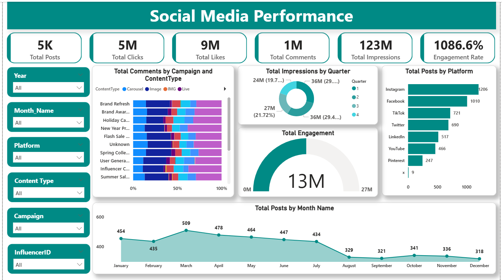
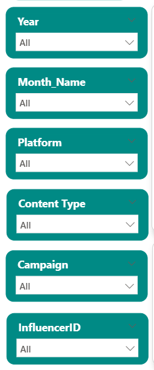
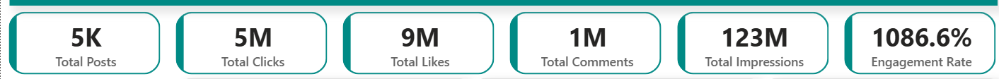
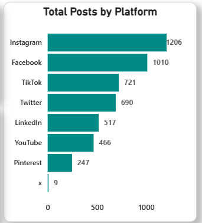
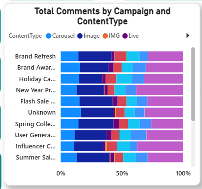
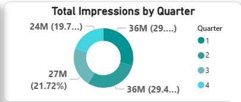
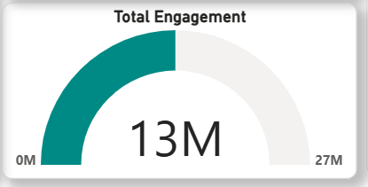
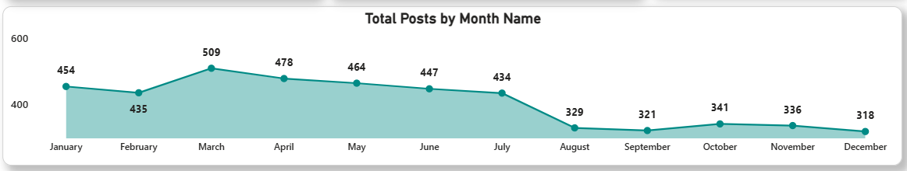

n# 📊 Social Media Performance Dashboard

## 📌 Project Overview

The Social Media Performance Dashboard is built in Power BI to analyze the performance of different social media platforms, campaigns, and content types.

This dashboard helps users understand:

- Total Posts
- Total Likes
- Total Comments
- Total Clicks
- Total Impressions
- Engagement Rate
- Platform-wise Performance
- Quarter-wise Impressions
- Monthly Trends

---

# 📷 Complete Dashboard



---

# 🎯 Problem Statement

The objective of this dashboard is to monitor social media performance and identify:

- The best-performing platform
- The best-performing campaign
- The most engaging content type
- Monthly engagement trends
- Quarter-wise impressions

---

# 🛠️ Tools Used

- Microsoft Excel
- Power BI Desktop
- Power Query
- DAX
- GitHub

---

# 📂 Dataset Information

| Column Name |
|------------|
| PostID |
| Date |
| Platform |
| Campaign |
| Content Type |
| Likes |
| Comments |
| Clicks |
| Impressions |
| Influencer ID |

---

# 🔄 Data Cleaning Steps (Power Query)

### Step 1: Load Dataset

- Open Power BI Desktop.
- Click **Home → Get Data → Text/CSV**.
- Select the dataset file.
- Click **Load**.

---

### Step 2: Open Power Query Editor

- Click **Transform Data**.
- Open the Power Query Editor.

---

### Step 3: Remove Duplicate Rows

- Select all columns.
- Click **Home → Remove Rows → Remove Duplicates**.

---

### Step 4: Remove Blank Values

- Select the required columns.
- Click the filter icon.
- Remove blank rows.

---

### Step 5: Trim and Clean Text

Select text columns:

- Platform
- Campaign
- Content Type

Click:

**Transform → Format → Trim**

**Transform → Format → Clean**

---

### Step 6: Change Data Types

| Column | Data Type |
|---------|---------|
| Date | Date |
| Likes | Whole Number |
| Comments | Whole Number |
| Clicks | Whole Number |
| Impressions | Whole Number |

---

### Step 7: Create Month Column

```DAX
Month Name = FORMAT(SocialMedia[Date], "MMMM")
```

---

### Step 8: Create Quarter Column

```DAX
Quarter = "Q" & FORMAT(SocialMedia[Date], "Q")
```

---

# 📊 DAX Measures

### Total Posts

```DAX
Total Posts = COUNT(SocialMedia[PostID])
```

### Total Likes

```DAX
Total Likes = SUM(SocialMedia[Likes])
```

### Total Comments

```DAX
Total Comments = SUM(SocialMedia[Comments])
```

### Total Clicks

```DAX
Total Clicks = SUM(SocialMedia[Clicks])
```

### Total Impressions

```DAX
Total Impressions = SUM(SocialMedia[Impressions])
```

### Engagement Rate

```DAX
Engagement Rate =
DIVIDE(
SUM(SocialMedia[Likes]) +
SUM(SocialMedia[Comments]) +
SUM(SocialMedia[Clicks]),
SUM(SocialMedia[Impressions])
) * 100
```

---

# 📈 Dashboard Creation Steps

## Step 1: Create Slicers

Create slicers for:

- Year
- Month
- Platform
- Campaign
- Content Type



---

## Step 2: Create KPI Cards

Create KPI cards for:

- Total Posts
- Total Likes
- Total Comments
- Total Clicks
- Total Impressions
- Engagement Rate



---

## Step 3: Create Bar Chart

### Total Posts by Platform

- X-axis → Total Posts
- Y-axis → Platform



---

## Step 4: Create Stacked Bar Chart

### Total Comments by Campaign

- X-axis → Total Comments
- Y-axis → Campaign
- Legend → Content Type



---

## Step 5: Create Donut Chart

### Total Impressions by Quarter

- Values → Total Impressions
- Legend → Quarter



---

## Step 6: Create Gauge Chart

### Total Engagement

- Value → Total Engagement
- Maximum Value → Total Impressions



---

## Step 7: Create Line Chart

### Total Posts by Month

- X-axis → Month
- Y-axis → Total Posts



---

# 🎛️ Filters Used

- Year
- Month
- Platform
- Campaign
- Content Type
- Influencer ID

---

# 💡 Key Insights

✅ Instagram generated the highest number of posts.

✅ Video content received the highest engagement.

✅ Quarter 1 had the highest impressions.

✅ March recorded the highest engagement.

✅ Engagement increased month by month.

---

